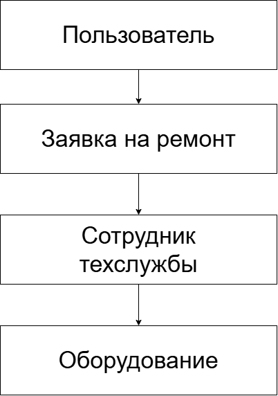

# Лабораторная работа №1

## Анализ предметной области информационной системы

## 1. Описание предметной области
Система предназначена для автоматизации работы с поломками и неисправностями в организациях. Заявитель отправляет информацию о поломке через систему, а сотрудники технической службы получают уведомление, назначают мастера и следят за процессом ремонта до его завершения.

## 2. Проблема и цель системы
Проблема: Заявки о поломках передаются в устной форме, через чаты или на бумаге. Из-за этого часть обращений теряется, невозможно быстро найти ответственного специалиста и отследить статус ремонта.
Цель: Создать единую и удобную систему для быстрой отправки, назначения и контроля выполнения всех заявок на ремонт.
Область применения: Техническая служба и отдел административно-хозяйственного обеспечения внутри любых коммерческих или государственных организаций, учебных заведений и бизнес-центров.

## 3. Анализ предметной области
Для работы системы выделено 5 основных объектов:

1. Заявитель (Пользователь)
   Назначение: Человек, который сообщает о неисправности.
   Характеристики: ID, ФИО, отдел, контакты, логин, пароль.

2. Заявка
   Назначение: Документ (запись) с описанием проблемы.
   Характеристики: Номер заявки, тема, описание проблемы, дата создания, приоритет, кабинет/помещение.

3. Оборудование / Помещение
   Назначение: Объект, которому требуется ремонт.
   Характеристики: Название, инвентарный номер, местоположение.

4. Исполнитель (Специалист)
   Назначение: Сотрудник технической службы, устраняющий поломку.
   Характеристики: ID, ФИО, специализация (сантехник, электрик и т.д.), контакты, текущая загрузка.

5. Статус заявки
   Назначение: Этап выполнения работ по заявке.
   Характеристики: Название состояния («Новая», «В работе», «Ожидает запчастей», «Завершена»).

### Связи между объектами:
Заявитель создает Заявку.
Заявка привязывается к Оборудованию / Помещению.
Заявке назначается Исполнитель.
Заявка изменяет свой Статус в процессе работы.

## 4. Пользователи и роли

| Роль | Назначение | Основные действия |
| :--- | :--- | :--- |
| Заявитель | Обычный сотрудник организации | Создает заявки, смотрит их текущий статус, оставляет комментарии к своим заявкам |
| Техник / Исполнитель | Специалист, выполняющий ремонт | Просматривает назначенные на него заявки, меняет статус работ, добавляет заметки к ремонту |
| Администратор / Диспетчер | Руководитель техслужбы | Видит все заявки, распределяет их по исполнителям, управляет списком пользователей и оборудования |

## 5. Функциональные требования

  FR-01. Система должна позволять заявителю создавать новую заявку с указанием темы, подробного описания и расположения поломки.
  
  FR-02. Система должна позволять заявителю просматривать список и статусы всех ранее отправленных им заявок.
  
  FR-03. Система должна позволять диспетчеру просматривать полный список всех поступающих заявок.
  
  FR-04. Система должна позволять диспетчеру назначать определенного исполнителя на заявку.
  
  FR-05. Система должна позволять диспетчеру и исполнителю менять текущий статус заявки.
  
  FR-06. Система должна позволять пользователям фильтровать заявки по статусу, дате создания и приоритету.
  
  FR-07. Система должна позволять исполнителю оставлять технические комментарии о ходе выполнения работ.
  
  FR-08. Система должна позволять администратору добавлять новые учетные записи пользователей и изменять их роли.
  
  FR-09. Система должна отправлять уведомления заявителю при изменении статуса его заявки.
  
  FR-10. Система должна позволять администратору вести учет оборудования и помещений.
  

## 6. Концепция информационной системы

Назначение: Автоматизация и централизация процессов приёма, обработки и контроля выполнения заявок на техническое обслуживание и ремонт.
Тип системы: Веб-приложение (доступно через браузер с компьютера и смартфона).
Основные компоненты:
  1. Клиентская часть (Web-интерфейс) — визуальные экранные формы в браузере для заявителей и сотрудников.
  2. Серверная часть — программа на сервере, принимающая запросы, проверяющая права доступа и обрабатывающая логику работы с заявками.
  3. База данных — место хранения сведений о пользователях, заявках, статусах и оборудовании.
Результат использования:
  Ускорение обработки обращений, полное исключение потери заявок, прозрачный контроль работы мастеров и понятный статус ремонта для пользователей.

## 7. Схемы
Схема предметной области расположена по следующим путям в репозитории: 

 

## 8. Вывод
В ходе выполнения лабораторной работы №1 была проанализирована предметная область «Система управления заявками на ремонт». Были определены ключевые проблемы существующего процесса и цели создания ИС, выделены 5 базовых объектов, сформулированы 3 роли пользователей и составлены 10 функциональных требований. Разработанная концепция веб-приложения полностью готова для проектирования архитектуры и базы данных на следующих этапах.
