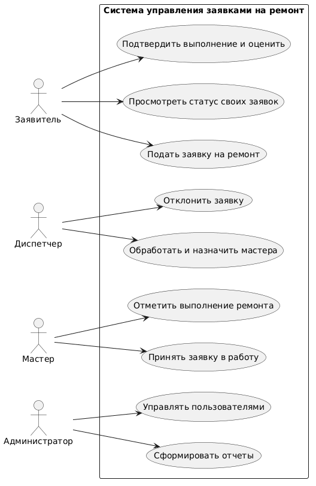
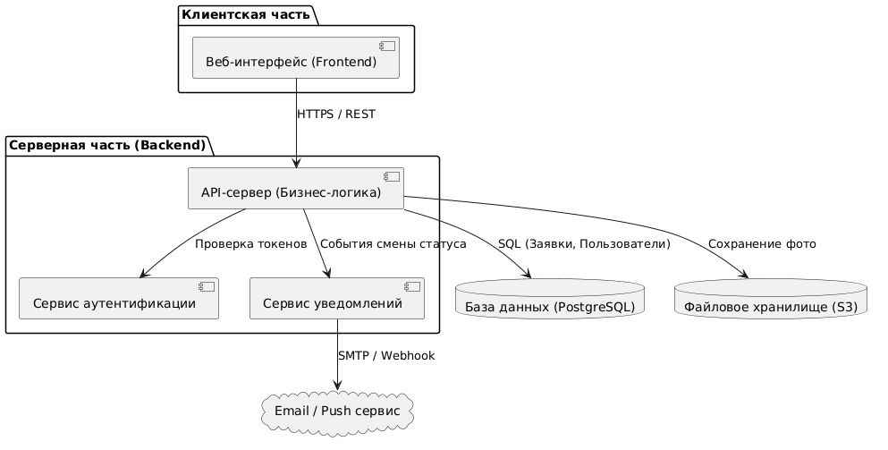

# Лабораторная работа №2
## Проектирование информационной системы

---

## 1. Описание предметной области
Система управления заявками на ремонт предназначена для автоматизации процессов регистрации, обработки и контроля выполнения заявок на ремонт помещений и оборудования внутри организации.

**Решаемые проблемы:**
* **Потеря заявок:** Исключается утеря обращений, поступающих по устным просьбам, мессенджерам или бумажным запискам.
* **Отсутствие прозрачности:** Заявитель и руководство видят текущий статус ремонта и ответственного исполнителя в режиме реального времени.
* **Низкий контроль сроков:** Система фиксирует время подачи, назначения и завершения работ, позволяя оценивать эффективность работы технической службы.

---

## 2. Пользователи и роли

| Роль | Назначение | Основные задачи | Доступные функции | Уровень доступа |
| :--- | :--- | :--- | :--- | :--- |
| **Заявитель (Сотрудник)** | Фиксация поломок и контроль их устранения | Создание заявок, просмотр статуса, подтверждение выполнения | Создание заявки, добавление фото/описания, просмотр своих заявок, закрытие/оценка заявки | Ограниченный (только свои заявки) |
| **Диспетчер (Оператор техслужбы)** | Первичная обработка и распределение заявок | Проверка заявок, назначение мастеров, изменение приоритета | Просмотр всех заявок, фильтрация, назначение ответственного, смена статусов, отклонение | Расширенный (управление всеми заявками) |
| **Мастер (Исполнитель)** | Выполнение ремонтных работ | Выполнение поставленных задач, отчетность по работам | Просмотр назначенных задач, смена статуса ("В работе", "Выполнено"), комментарии | Ограниченный (только назначенные задачи) |
| **Администратор** | Управление системой и справочниками | Ведение учетных записей, настройка категорий оборудования/помещений | Управление пользователями, настройка справочников, просмотр аналитики | Полный доступ ко всем модулям |

---

## 3. Сценарии использования

### Сценарий 1: Подача заявки на ремонт
* **Название:** Подача заявки на ремонт
* **Инициатор:** Заявитель (Сотрудник)
* **Пошаговое описание:**
  1. Заявитель авторизуется в системе.
  2. Переходит в раздел «Новая заявка».
  3. Выбирает тип объекта (помещение или оборудование) и указывает его номер/название из справочника.
  4. Заполняет текстовое описание неисправности и выбирает степень срочности.
  5. Прикрепляет фотографии поломки (опционально).
  6. Нажимает кнопку «Отправить заявку».
  7. Система проверяет заполнение обязательных полей и сохраняет заявку со статусом «Новая».
  8. Заявитель получает уведомление с номером созданной заявки.
* **Ожидаемый результат:** Заявка успешно зарегистрирована в системе и доступна диспетчеру для обработки.

---

### Сценарий 2: Назначение ответственного мастера
* **Название:** Назначение ответственного мастера
* **Инициатор:** Диспетчер
* **Пошаговое описание:**
  1. Диспетчер открывает список заявок со статусом «Новая».
  2. Выбирает заявку из списка для детального просмотра.
  3. Изучает описание неисправности, объект и степень срочности.
  4. Открывает список доступных мастеров соответствующей квалификации.
  5. Выбирает мастера и назначает его ответственным за выполнение.
  6. Нажимает кнопку «Назначить».
  7. Система меняет статус заявки на «Назначена» и отправляет push/email-уведомление мастеру.
* **Ожидаемый результат:** Назначен исполнитель заявки, статус обновлен, мастер получил уведомление.

---

### Сценарий 3: Выполнение ремонта и смена статуса
* **Название:** Выполнение ремонта и смена статуса
* **Инициатор:** Мастер (Исполнитель)
* **Пошаговое описание:**
  1. Мастер авторизуется в системе и открывает раздел «Мои задачи».
  2. Выбирает назначенную заявку и переводит её в статус «В работе».
  3. Прибывает на объект и выполняет ремонтные работы.
  4. По завершении работ открывает карточку заявки в системе.
  5. Добавляет краткое описание проделанных работ и при необходимости прикрепляет фото результата.
  6. Переводит статус заявки в «Выполнено».
  7. Система отправляет уведомление Заявителю о завершении работ.
* **Ожидаемый результат:** Заявка переведена в статус «Выполнено», заявитель оповещен.

---

### Сценарий 4: Подтверждение и закрытие заявки
* **Название:** Подтверждение выполнения и закрытие заявки
* **Инициатор:** Заявитель (Сотрудник)
* **Пошаговое описание:**
  1. Заявитель получает уведомление о завершении ремонта.
  2. Переходит в карточку заявки.
  3. Проверяет качество выполненных работ на объекте.
  4. Если работы выполнены качественно, нажимает кнопку «Подтвердить выполнение».
  5. Оставляет оценку качества выполнения (от 1 до 5 звезд) и текстовый отзыв (опционально).
  6. Система переводит заявку в финальный статус «Закрыта».
* **Ожидаемый результат:** Заявка успешно закрыта, оценка сохранена в статистике.

---

### Сценарий 5: Формирование отчета по неисправностям
* **Название:** Формирование отчета по неисправностям
* **Инициатор:** Администратор / Диспетчер
* **Пошаговое описание:**
  1. Пользователь с ролью Диспетчера или Администратора переходит в модуль «Аналитика и отчеты».
  2. Задает временной период (например, текущий месяц) и фильтры (по категориям оборудования или подразделениям).
  3. Нажимает кнопку «Сформировать отчет».
  4. Система собирает данные, рассчитывает среднее время устранения неисправностей и количество закрытых/просроченных заявок.
  5. Отображает графики и сводную таблицу на экране.
  6. Пользователь экспортирует отчет в формат PDF или Excel.
* **Ожидаемый результат:** Сформирован аналитический отчет по работе технической службы за период.

---

## 4. Диаграмма сценариев использования (Use Case)

### Описание диаграммы:
* **Актёры:**
  * **Заявитель** — создает заявки, отслеживает их статус и подтверждает закрытие.
  * **Диспетчер** — обрабатывает входящие заявки и назначает исполнителей.
  * **Мастер** — принимает заявки в работу и отмечает их выполнение.
  * **Администратор** — формирует отчеты и управляет пользователями.
* **Связи:** Актеры связаны с соответствующими прецедентами (Use Cases), отражая разграничение зон ответственности в системе.

---

## 5. Компоненты системы

| Компонент | Назначение |
| :--- | :--- |
| **Веб-интерфейс (Frontend)** | Пользовательский интерфейс (React / Vue) для взаимодействия пользователей всех ролей с системой через браузер. |
| **API-сервер (Backend)** | Бизнес-логика системы (Node.js / Python / Java), обрабатывающая запросы, проверяющая права доступа и управляющая статусами заявок. |
| **Модуль аутентификации (Auth Service)** | Сервис идентификации и авторизации пользователей на основе JWT-токенов. |
| **Сервис уведомлений (Notification Service)** | Отправка e-mail и push-уведомлений пользователям при изменении статуса заявок. |
| **База данных (PostgreSQL)** | Реляционная БД для хранения данных о пользователях, заявках, оборудовании, помещениях и истории статусов. |
| **Файловое хранилище (S3 / Storage)** | Хранение прикрепленных к заявкам фотографий неисправностей и результатов ремонта. |

---

## 6. Диаграмма компонентов

### Описание диаграммы:
Клиентский веб-интерфейс отправляет HTTPS/REST запросы на Backend (API-сервер). Backend взаимодействует с сервисом аутентификации, читает/записывает данные в PostgreSQL, сохраняет фото в Файловое хранилище и инициирует отправку уведомлений через Email/Push сервис при смене статусов заявок.

---

## 7. Концепция информационной системы

* **Назначение и цель системы:** Автоматизация учета и обработки заявок на ремонт оборудования и помещений, повышение прозрачности работы технической службы и сокращение времени простоя.
* **Основные возможности:**
  * Подача заявок с фото и описанием в пару кликов;
  * Канбан-доска / список заявок для диспетчера и мастеров;
  * Назначение ответственных и отслеживание статусов в реальном времени;
  * Система уведомлений участников процесса;
  * Аналитика и сбор статистики по ремонтам.
* **Тип системы:** Веб-приложение (SPA + REST API) с адаптивным интерфейсом для мобильных устройств.
* **Взаимодействие компонентов:** Клиентская часть обращается к единому API-серверу, который организует безопасное взаимодействие с базой данных, сервисом файлов и внешней службой отправки уведомлений.
