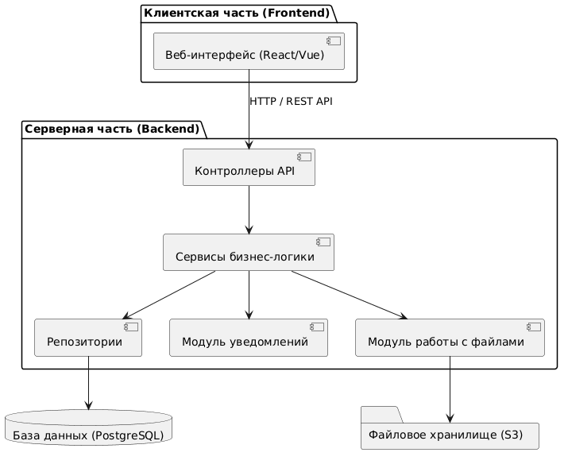
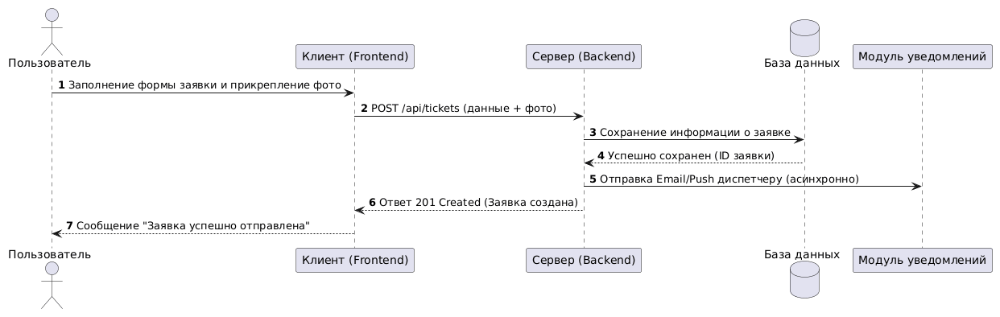

# Лабораторная работа №3
## Проектирование архитектуры информационной системы

**Курс:** Архитектура современных информационных систем  
**Студент:** Прилепская Ева (гр. ИТД-31)  
**Предметная область:** Система управления заявками на ремонт  

---

## Цель работы
Изучить принципы проектирования архитектуры информационных систем, определить структуру приложения, спроектировать взаимодействие между основными компонентами и подготовить структуру программного проекта для дальнейшей разработки.

---

## 1. Выбор архитектуры приложения
Для системы управления заявками на ремонт выбрана **трёхуровневая (3-tier) архитектура веб-приложения**.

### Основные уровни:
1. **Frontend (Клиентская часть):** Веб-интерфейс для работы пользователей (Заявитель, Диспетчер, Мастер, Администратор). Отвечает за отображение данных и отправку запросов.
2. **Backend (Серверная часть):** Обрабатывает HTTP-запросы (REST API), содержит бизнес-логику (смена статусов, проверка прав, назначение мастеров).
3. **Database (База данных) & Storage:** Хранение структурированных данных (пользователи, заявки) и файлов (фотографий неисправностей).

**Преимущества:** Независимая разработка, масштабируемость, чёткое разделение ответственности и безопасность данных.

---

## 2. Компоненты системы и их ответственность

| Компонент | Назначение и ответственность |
| :--- | :--- |
| **Frontend (React/Vue)** | Пользовательский веб-интерфейс, отображение форм и списков |
| **Controllers (Контроллеры)** | Приём HTTP-запросов, валидация входящих данных, формирование ответов |
| **Services (Сервисы)** | Бизнес-логика системы (проверка статусов, логика назначения мастеров) |
| **Repositories (Репозитории)** | Запросы к базе данных (CRUD-операции) |
| **Notification Module** | Нетиповой модуль: асинхронная отправка Email/Push уведомлений при смене статуса |
| **File Storage Module** | Загрузка и проверка фото фиксации неисправностей |
| **Database (PostgreSQL)** | Реляционная БД для хранения данных о заявках и пользователях |

---

## 3. Индивидуальная особенность предметной области
**Нетиповая функция:** Асинхронная отправка уведомлений (Email/Push) при смене статуса заявки и прикрепление медиафайлов (фото неисправностей).

* **Почему это важно:** Мастер и заявитель должны мгновенно получать оповещения о смене статуса заявки («Назначена», «В работе», «Выполнено») без задержки ответа сервера.
* **Отвечающие компоненты:** `Notification Module` (модуль уведомлений) и `File Storage Module` (хранилище S3/файловый модуль).

---

## 4. Структура проекта

```text
lab3/
├── frontend/             # Клиентская часть приложения
├── backend/              # Серверная часть
│   ├── controllers/      # Контроллеры (HTTP слой)
│   ├── services/         # Бизнес-логика
│   ├── repositories/     # Слой работы с БД
│   ├── models/           # Модели данных
│   └── routes/           # Маршрутизация API
├── database/             # Миграции и скрипты БД
├── diagrams/             # Архитектурные диаграммы
├── docs/                 # Документация
└── README.md             # Отчёт по лабораторной работе
```

---

## 5. Диаграмма архитектуры системы



*Описание:* Схема отражает разделение на Frontend, Backend (с контроллерами и сервисами), Базу данных, Файловое хранилище и отдельный Сервис уведомлений.

---

## 6. Диаграмма взаимодействия (Sequence Diagram)



*Описание:* Последовательность обработки запроса создания заявки от пользователя с сохранением фото и отправкой уведомления диспетчеру.

---

## Вывод

В ходе лабораторной работы была спроектирована трёхзвенная архитектура информационной системы управления заявками на ремонт, определены ключевые компоненты Backend и Frontend, выделена индивидуальная особенность (модуль уведомлений и файловый модуль) и подготовлена структура каталогов проекта.
